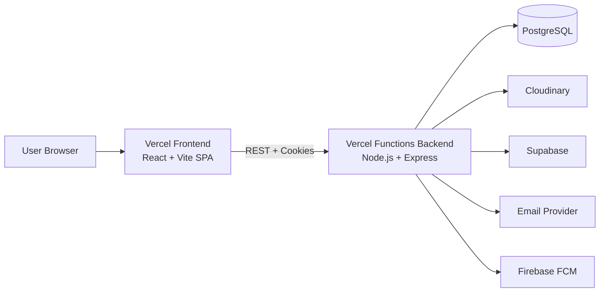
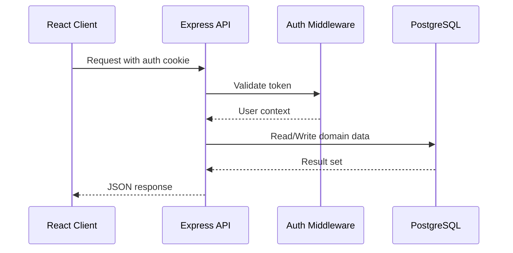

# Architecture

## System overview

## Backend architecture

The backend follows a layered structure:

- `server/routes/`: endpoint definitions and route grouping
- `server/controllers/`: business logic and orchestration
- `server/models/`: Sequelize models and associations
- `server/database/`: DB and external storage connectors
- `server/middlewares/`: cross-cutting concerns (auth, etc.)
- `server/jobs/`: scheduled cleanup and course status updates

## Request flow (typical protected route)

## Module map

- Authentication: `server/routes/auth.route.js`, `server/controllers/auth.controller.js`
- Courses and learning flow: `server/routes/curso.route.js`, `server/controllers/curso.controller.js`
- Progress tracking: `server/routes/progresso.route.js`, `server/controllers/progresso.controller.js`
- Forum: `server/routes/forum*.routes.js`, `server/controllers/forum*.controller.js`
- Certificates: `server/routes/certificado.route.js`, `server/controllers/certificado.controller.js`
- Notifications/FCM: `server/routes/notificacao.route.js`, `server/routes/fcm.route.js`

## Scheduled jobs

- Course status updater (`server/jobs/courseStatusUpdater.js`)
  - updates asynchronous and synchronous course status periodically
- FCM cleanup (`server/jobs/fcmCleanup.js`)
  - removes inactive push notification tokens

## Frontend architecture

- Root app and route composition: `client/src/App.jsx`
- Auth state management: `client/src/store/authStore.js`
- Route-level pages: `client/src/*.jsx`
- Shared UI and feature components: `client/src/components/`

## Security and access control

- JWT-based authentication with secure cookie transport
- Protected routes on frontend and backend middleware checks
- CORS allowlist configured in `server/server.js`

## Runtime notes

- Frontend calls backend via `VITE_API_URL`
- API base defaults to `http://localhost:4000` for local development
- Healthcheck endpoint: `GET /api`
